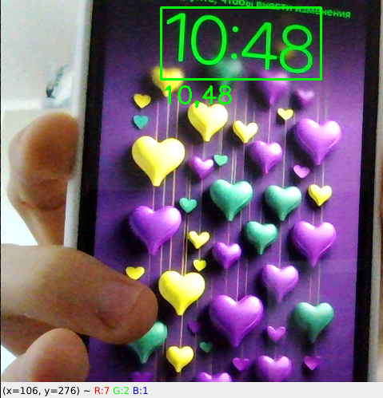
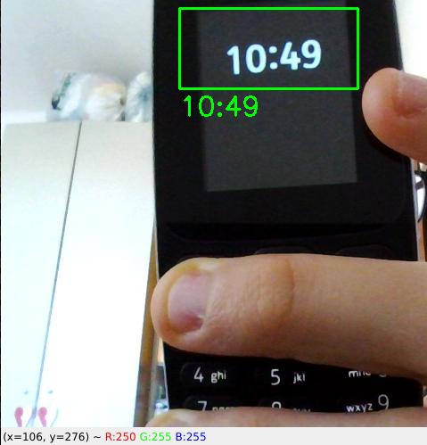

# TimeDetector

Simple AI project which detects any mentions of time from recording camera and prints it to the terminal if it noticed any clocks.

I added a small zone where he checks time to prevent overheat and overusage of your CPU, but if you want you can remove her (even for Intel Core i7 11'th Gen doens't take it easy).

## Screenshots

  

  

## To-do

- [ ] **Create a requirements.txt**
